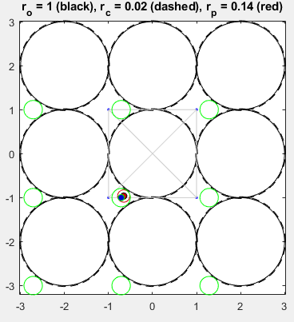
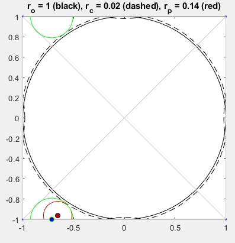
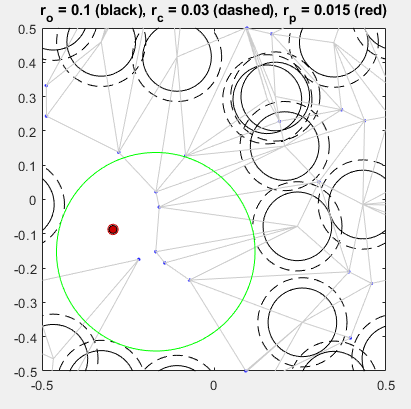
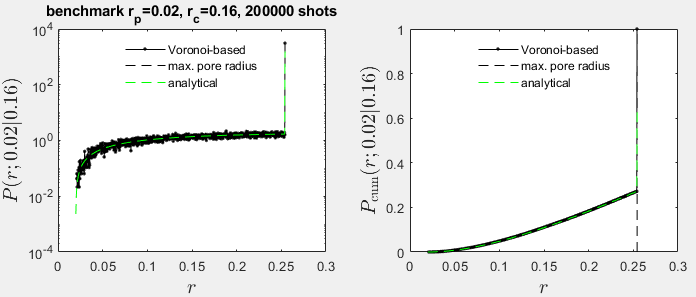
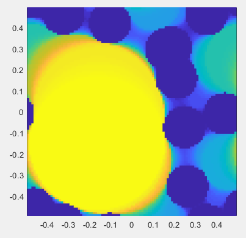

# CODE-GPSD-2D
generalized geometric pore size distribution for two-dimensional (square, periodic) systems composed of monodisperse circles

The matlabTM code was written 11 Nov 2022 by Martin Kroger (http://www.complexfluids.ethz.ch) and is part of the supplementary information of the following article: 

      Samarth Agrawal, Sandra Gamlarini, Martin Kröger,
      Voronoi tessellation-based algorithm for determining rigorously defined 
      classical and generalized geometric pore size distributions,
      Physical Review E 107 (2023) 015307.
      
### Prerequisites and installation instructions

Download this repository to a machine that has matlabTM 2021 or higher installed. 
All matlab functions included in this repository can be called individually. Examples on how 
to use them are given below. The definition of the generalized pore size distribution, and further 
explanations are provided in the published article. We are planning to publish a 3D version
of this code in the near future. 

### Visualize a pore for a randomly chosen point *p* inside the benchmark configuration

      code_single_random_pore_for_our_benchmark_from_edges.m
      
Executing this parameter-free code creates a figure that shows the benchmark configuration (a single eventually coated circle, 
subject to periodic boundary conditions). In addition the position of the randomly chosen point (red), enclosed by a red circle 
with a radius of the probe particle, and the pore circle (green, centered at the blue point) calculated by this voronoi-based code.
      

      
### Visualize a pore for a randomly chosen point *p* inside the multidisk configuration 

      code_single_random_pore_for_our_multidisk_from_edges.m
      
This code creates a figure that shows the multidisk configuration (20 eventually coated circles, 
subject to periodic boundary conditions). In addition the position of the randomly chosen point (red), enclosed by a red circle 
with a radius of the probe particle, and the pore circle (green, centered at the blue point) calculated by this voronoi-based code.
      

      
### Calculate voronoi-based G-PSD for the benchmark

      code_G_PSD_2D_for_our_benchmark.m
      
calculates and displays the voronoi-based G-PSD as well as the cumulative G-PSD for the benchmark. The number of shots (M) is
specified in the file. The result is compared with the analytical result (dashed green). 
      

### Calculate voronoi-based G-PSD for the multidisk

      code_G_PSD_2D_for_our_multidisk.m
      
calculates and displays the voronoi-based G-PSD as well as the cumulative G-PSD for the multidisk with 20 circles. The number of shots (M) is
specified in the file. 

### Calculate voronoi-based G-PSD for user-defined system

The user has to specify box size *L* and *N* material center coordinates *x(1..N,1:2)* as well as the
radius *ro* of a material circle,
thickness *rc* of the material coating, 
radius *rp* of the probe circle, 
number *PSDbins* of bins of the G-PSD,  
number *M* of random shots to calculate the G-PSD. Then call 

       [radius,GPSD,GPSDcum] = code_G_PSD_2D_for_user_defined_system(L,x,ro,rc,rp,shots,PSDbins)
       
The resulting vectors *radius*, *GPSD*, and *GPSDcum* contain radii *r*, the G-PSD *P(r;rc|rp)*, and the cumulative G-PSD *Psum(r;rc|rp)*. 

Example: 

      L  = 1; 
      dx = 0.1; 
      [X,Y] = meshgrid(-L/2:dx:(L/2-dx),-L/2:dx:(L/2-dx));
      remove = find(sqrt(X.^2+Y.^2)<0.3); 
      X(remove) = [];
      Y(remove) = [];
      x = [X(:) Y(:)];        % matrix with N rows and 2 colunms

      ro = dx/2;
      rc = 0;
      rp = 0;

      shots = 10000;
      PSDbins = 100; 

      [radius,GPSD,GPSDcum] = code_G_PSD_2D_for_user_defined_system(L,x,ro,rc,rp,shots,PSDbins);
      
      figure; 
      plot(radius,GPSDcum,'k.-'); 
      xlabel('r');
      ylabel('P_{cum}(r|0)')
      
### Calculate grid-based G-PSD for user-defined system

The user has to specify box size *L* and *N* material center coordinates *x(1..N,1:2)* as well as the
radius *ro* of a material circle,
thickness *rc* of the material coating, 
radius *rp* of the probe circle, 
number *PSDbins* of bins of the G-PSD,  
number *grid_resolution* of nodes in each dimension. Then call 
  
      [radius,GPSD,GPSDcum,cpusecs,X,Y,MK]=reference_GPSD_2D_via_grid(L,x,ro,rc,rp,grid_resolution,PSDbins)

The resulting vectors *radius*, *GPSD*, and *GPSDcum* contain radii, the G-PSD, and the cumulative G-PSD 
obtained with the grid-based method. The matrices *X*, *Y*, and *MK* contain the pore radii for every grid node
and can be visualized via

      figure; pcolor(X,Y,MK); shading flat; axis image; 
      
Example: 

      [N,L,ro,x] = create_our_multidisk;
      [radius,GPSD,GPSDcum,cpusecs,X,Y,MK]=reference_GPSD_2D_via_grid(L,x,0.1,0,0,100,1000);
      figure; pcolor(X,Y,MK); shading flat; axis image; colorbar; 
      

